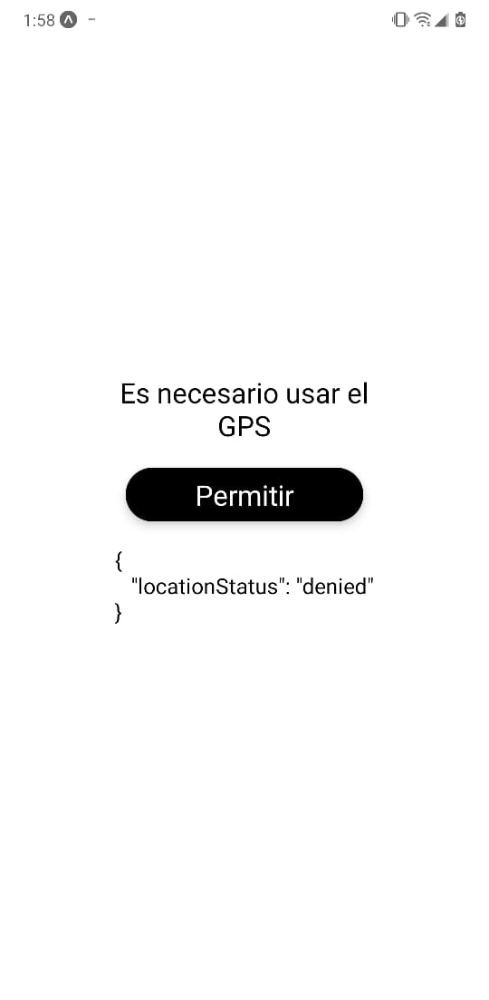
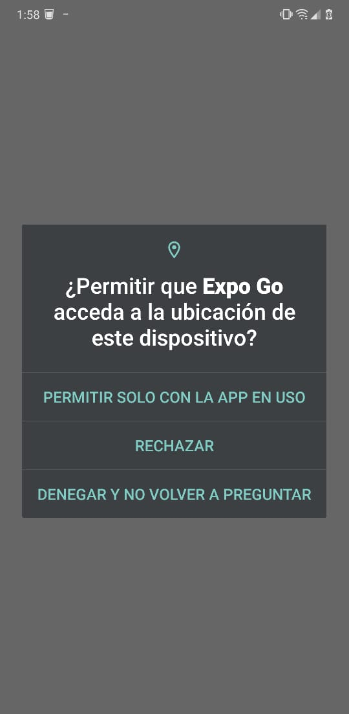
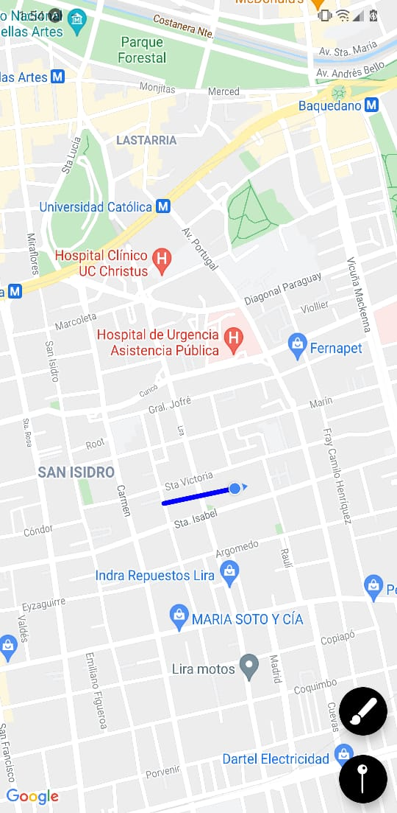

# Gugli Maps!

- Proyecto de prueba con expo-cli, una app de mapas con la posibilidad de hacer tracking de tu ruta
- incluye un custom hooks useLocations
- para deployar a prod, es necesario configurar las api keys de maps en google

Snaps:
1. Screen para permisos:

  

2. Screen OS:

  

3. Maps with polylines:

  

 
 
 
 

This examples are part from the [React Native: Aplicaciones nativas para IOS y Android course](https://www.udemy.com/course/react-native-fh/)